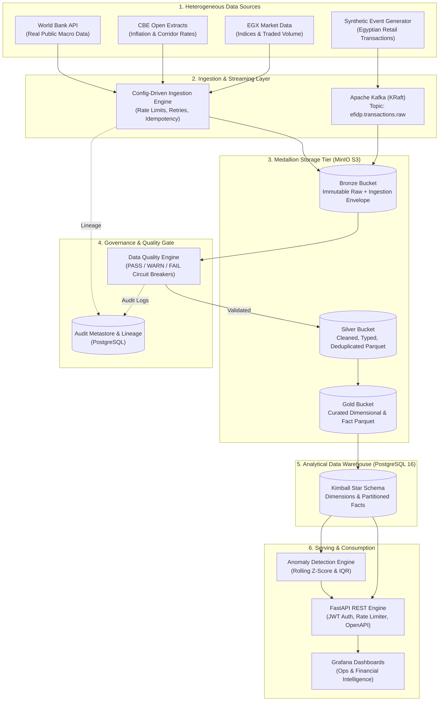
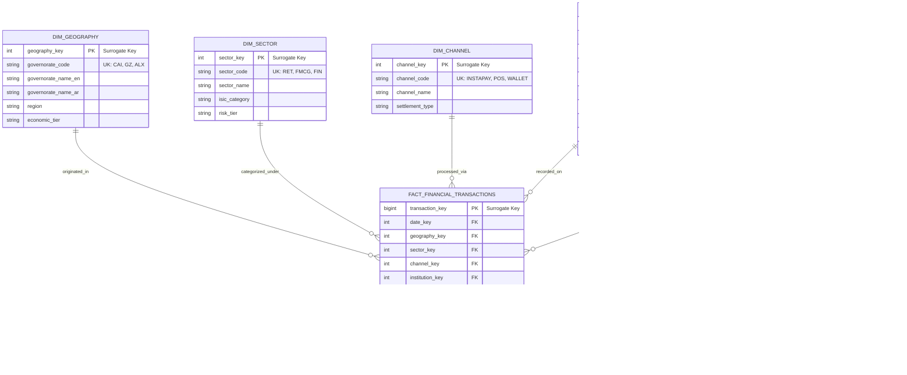

# EFIDP — Egypt Financial Intelligence Data Platform
## Phase 0: System Architecture & Requirements Blueprint

**Document Version:** 1.0.0
**Status:** Approved for Phase Review
**Author:** Principal Data Engineer & Platform Architect
**Project:** Egypt Financial Intelligence Data Platform (`efidp-platform`)

---

## 1. Requirements Specification

### 1.1 Executive Summary
The **Egypt Financial Intelligence Data Platform (EFIDP)** is an enterprise-grade financial data engineering and analytics platform. It establishes a modernized, auditable, and resilient Lakehouse and Data Warehouse foundation that ingests, cleanses, transforms, models, serves, and monitors macroeconomic indicators, capital market metrics, and high-frequency financial transaction event streams for the Egyptian market context.

### 1.2 Motivation & System Purpose
Financial and macroeconomic data in developing and emerging markets—specifically Egypt—is typically fragmented across disparate formats (PDF reports, Excel/CSV releases, public statistical portals, REST APIs, and core banking transaction logs). Financial institutions, risk modeling teams, and macroeconomic analysts struggle with:
1. **Disparate Refresh Cadences:** Mixing daily market movements with monthly inflation figures and streaming point-of-sale (POS)/mobile wallet transactions.
2. **Quality & Freshness Gaps:** Late-arriving facts, missing observations, fluctuating currency pegs/exchange rates, and schema drift.
3. **Lack of End-to-End Lineage:** Inability to trace an executive KPI or anomaly alert back to raw source payloads with cryptographic auditability.

EFIDP provides a reproducible reference implementation of a **Modern Data Platform** combining **Medallion Architecture (Bronze/Silver/Gold)**, **Kimball Dimensional Modeling**, **Asynchronous Microservices (FastAPI)**, **Distributed Orchestration (Airflow)**, and **Event-Driven Streaming (Kafka)**.

---

## 2. Business Use Cases

| Use Case ID | Name | Target Persona | Business Value & Core Question |
|:---|:---|:---|:---|
| **UC-01** | **Macroeconomic Trend & Inflation Tracking** | Chief Economist / Strategy Officer | Track historical trends in Egyptian inflation (CPI), Central Bank of Egypt (CBE) corridor rates, M2 money supply, and foreign exchange reserves over time. |
| **UC-02** | **Transaction Velocity & Volume Analytics** | Head of Retail Banking / Payments | Analyze daily transaction velocity, total volume, and gross merchandise value (GMV) across Egyptian governorates (Cairo, Giza, Alexandria, Delta, Upper Egypt) and retail payment channels (InstaPay, Mobile Wallet, POS, ATM). |
| **UC-03** | **Governorate & Sector Activity Disparity** | Regional Operations Director | Identify disparities in economic activity and payment density across Egyptian governorates and business sectors (FMCG, Retail, Energy, Agriculture, Tourism). |
| **UC-04** | **Financial Anomaly & Outlier Identification** | Risk & Compliance Analyst | Detect statistical deviations (spikes in transaction volume, abrupt velocity shifts, sudden cross-governorate flow surges) using rolling Z-scores and IQR without hardcoding subjective thresholds. |
| **UC-05** | **Data Freshness & Pipeline Health Auditing** | Data Platform Lead / SRE | Continuous operational observability into pipeline SLAs, ingestion latencies, data quality pass rates, and schema validation failures. |

---

## 3. Functional Requirements

### 3.1 Data Ingestion
- **FR-ING-01:** Config-driven ingestion framework supporting batch sources (`REST API`, `CSV`, `Parquet`, `JSON`) and streaming sources (`Kafka`).
- **FR-ING-02:** Standardized ingestion metadata envelope: `ingestion_id`, `source_id`, `source_type` (`real_public`, `synthetic`, `derived`), `extracted_at`, `payload_hash`, `schema_version`.
- **FR-ING-03:** Idempotent ingestion ensuring duplicate runs of the same batch do not create duplicate raw objects.
- **FR-ING-04:** Graceful backoff and exponential retry handling for external API rate limits (HTTP 429) and transient network disconnects (HTTP 5xx).

### 3.2 Storage & Medallion Layers
- **FR-MED-01 (Bronze):** Immutable raw storage in S3-compatible object storage (MinIO) partitioned by `source_id/year=YYYY/month=MM/day=DD/`.
- **FR-MED-02 (Silver):** Conformed datasets cleaned with PySpark/Pandas: schema enforcement, data type casting, null imputation/rejection, deduplication, standardized ISO datetime (UTC) and EGP currency normalization.
- **FR-MED-03 (Gold):** Analytical models formatted as columnar Parquet files and synchronized into PostgreSQL analytical warehouse tables using star-schema structures.

### 3.3 Data Quality & Validation
- **FR-DQ-01:** Comprehensive validation rules per layer (null check thresholds, uniqueness, range boundaries, foreign key referential integrity).
- **FR-DQ-02:** Tri-state verification results: `PASS`, `WARN`, `FAIL`.
- **FR-DQ-03:** Automated circuit breakers: Pipelines halt and notify when `FAIL` conditions occur on critical business keys or null thresholds.
- **FR-DQ-04:** Persistent DQ audit log table storing rule execution records, evaluated row counts, and failure percentages.

### 3.4 Data Serving (API)
- **FR-API-01:** High-performance asynchronous FastAPI REST endpoints for time-series queries, governorate summaries, economic indicators, and quality metrics.
- **FR-API-02:** Strict request/response serialization and validation via Pydantic v2 schemas.
- **FR-API-03:** API security via Bearer Token / JWT authentication with role-based access control (`analyst`, `admin`, `auditor`).
- **FR-API-04:** Standard pagination (`limit`, `offset`), filtering, and cursor-based historical lookups.

### 3.5 Streaming & Event Processing
- **FR-STR-01:** Synthetic transaction generator emitting realistic JSON transaction events according to Egyptian banking distribution parameters.
- **FR-STR-02:** Kafka topic management with defined partitions, retention policies, and consumer group offset management.
- **FR-STR-03:** Stream ingestion consumer validating event schemas against JSON Schema / Pydantic models before pushing to Bronze/Silver buffers.

---

## 4. Non-Functional Requirements

| Metric | Target | Rationale |
|:---|:---|:---|
| **Portability & Local Dev** | Single-command startup (`docker compose up -d`) | Eliminates host configuration variance across developer machines. |
| **Data Integrity** | Zero duplicate fact records across Gold warehouse tables | Financial reporting requires strict idempotency and surrogate key constraints. |
| **API Latency** | p95 < 120ms for analytical aggregate queries | Fast response for interactive dashboards and external consumer systems. |
| **Test Coverage** | >= 80% coverage on core business logic, transforms, and validators | Prevents regression in financial calculation rules and data parsing. |
| **Pipeline Reliability** | At least 3 retries with jittered exponential backoff | Prevents transient network errors from failing scheduled overnight DAG runs. |
| **Security & Privacy** | Zero plaintext secrets in code or repository; clear labeling of synthetic data | Adheres to DevSecOps standards; prevents confusion regarding regulatory compliance. |
| **Modularity** | Separation of ingestion adapters, transformers, validators, and orchestration | Allows adding new economic data sources without altering pipeline infrastructure. |

---

## 5. Architecture Proposal

EFIDP is structured around an event-driven, decoupled Lakehouse and Data Warehouse pattern:

```
+---------------------------------------------------------------------------------------------------+
|                                      DATA SOURCE TIER                                             |
|                                                                                                   |
|  +------------------------+  +--------------------------+  +-----------------------------------+  |
|  | Real Public Sources    |  | File / Open Data Drops   |  | Synthetic Financial Feeds         |  |
|  | - World Bank API (EGY) |  | - CAPMAS Statistical CSV |  | - High-velocity Transaction Engine|  |
|  | - CBE Public Metrics   |  | - Egyptian Exchange EGX  |  | - Mobile Wallet / InstaPay Stream|  |
|  +-----------+------------+  +------------+-------------+  +-----------------+-----------------+  |
+--------------|----------------------------|----------------------------------|--------------------+
               |                            |                                  |
               v                            v                                  v
+------------------------------------------------------------------------------+--------------------+
|                                    INGESTION TIER                                                 |
|                                                                                                   |
|  +---------------------------------------+      +----------------------------------------------+  |
|  | Batch Connectors (Polite Rate-Limit)  |      | Streaming Ingestion (Kafka Producers)        |  |
|  | - HTTP Session with Backoff Retries   |      | - Partitioned Topic: `financial.transactions`|  |
|  | - File System & S3 Scanners           |      | - Event Envelope & Schema Validation         |  |
|  +-------------------+-------------------+      +----------------------+-----------------------+  |
+----------------------|-------------------------------------------------|--------------------------+
                       |                                                 |
                       v                                                 v
+---------------------------------------------------------------------------------------------------+
|                                  STORAGE & LAKEHOUSE TIER                                         |
|                                                                                                   |
|  +---------------------------------------------------------------------------------------------+  |
|  | MinIO (S3-Compatible Object Store)                                                          |  |
|  |                                                                                             |  |
|  |  [ BRONZE BUCKET ]                                                                          |  |
|  |  - Raw immutable objects: `s3://efidp-bronze/{source}/year=YYYY/month=MM/batch_{id}.json`   |  |
|  |                                                                                             |  |
|  |          |                                                                                  |  |
|  |          v  (PySpark / Pandas Validation & Cleansing)                                       |  |
|  |                                                                                             |  |
|  |  [ SILVER BUCKET ]                                                                          |  |
|  |  - Parquet format with Snappy compression: `s3://efidp-silver/{domain}/`                    |  |
|  |  - Schema enforced, typed, deduplicated, quality flagged                                    |  |
|  |                                                                                             |  |
|  |          |                                                                                  |  |
|  |          v  (Dimensional Modeling & Aggregations)                                           |  |
|  |                                                                                             |  |
|  |  [ GOLD BUCKET ]                                                                            |  |
|  |  - Curated dimensional Parquet datasets: `s3://efidp-gold/facts/`, `s3://efidp-gold/dims/`  |  |
|  +---------------------------------------------------------------------------------------------+  |
+---------------------------------------------------------------------------------------------------+
                               |
                               v
+---------------------------------------------------------------------------------------------------+
|                                ANALYTICAL WAREHOUSE TIER                                          |
|                                                                                                   |
|  PostgreSQL 16 (Star Schema Warehouse & System Metastore)                                          |
|  +---------------------------------------------------------------------------------------------+  |
|  | Dimensions: `dim_date`, `dim_geography`, `dim_sector`, `dim_institution`, `dim_channel`     |  |
|  | Facts:      `fact_economic_indicators`, `fact_daily_market`, `fact_financial_transactions`  |  |
|  | Aggregates: `agg_governorate_daily_velocity`, `agg_sector_monthly_kpi`                      |  |
|  | Governance: `audit_pipeline_runs`, `audit_quality_checks`, `metadata_lineage`               |  |
|  +---------------------------------------------------------------------------------------------+  |
+---------------------------------------------------------------------------------------------------+
                               |
                               v
+---------------------------------------------------------------------------------------------------+
|                                     SERVING & CONSUMPTION                                         |
|                                                                                                   |
|  +--------------------------------------------+    +-------------------------------------------+  |
|  | FastAPI Serving Engine                     |    | Observability & Analytics                 |  |
|  | - OpenAPI 3.1 Swagger Docs                 |    | - Prometheus Metrics Exporter             |  |
|  | - Bearer JWT Auth & Rate Limiter           |    | - Grafana Executive Dashboards            |  |
|  | - Time-series, Spatial, & Anomaly Queries   |    | - Automated Anomaly Detection Engine      |  |
|  +--------------------------------------------+    +-------------------------------------------+  |
+---------------------------------------------------------------------------------------------------+
```

---

## 6. Technology Decision Matrix

| Layer / Concern | Chosen Technology | Evaluated Alternatives | Rationale & Trade-off Justification |
|:---|:---|:---|:---|
| **Core Language** | **Python 3.11+** | Go, Scala | Industry standard for data engineering; native integration with PySpark, Great Expectations, FastAPI, and Airflow. Excellent typing capabilities (`typing`, `Pydantic`). |
| **Object Storage** | **MinIO** | Local filesystem, LocalStack | High fidelity S3 API compatibility; lightweight, robust Docker image; identical SDK semantics (`boto3`) to AWS S3. |
| **Analytical Warehouse** | **PostgreSQL 16** | ClickHouse, DuckDB | Ubiquitous, robust SQL standards, transactional integrity for metadata/auditing, indexed star schema joins. DuckDB is utilized for local in-memory queries when appropriate. |
| **Distributed Compute** | **PySpark 3.5** | Plain Pandas, Dask | De-facto standard for enterprise big data pipelines; demonstrates enterprise distributed processing competence; partition pruning and Parquet optimizations. |
| **Orchestration** | **Apache Airflow 2.8+** | Prefect, Dagster | Universal industry recognition in enterprise data engineering portfolios; robust scheduler, task isolation, and backfill capabilities. |
| **Streaming Platform** | **Apache Kafka (KRaft)** | RabbitMQ, Redis Streams | High-throughput distributed log; industry standard for financial event streaming; KRaft eliminates Zookeeper complexity. |
| **Serving Framework** | **FastAPI** | Flask, Django REST | Native async I/O, automatic OpenAPI generation, built-in Pydantic v2 validation, high throughput. |
| **Data Validation** | **Great Expectations & Custom Guard Engine** | Pandera, Soda Core | Great Expectations provides declarative expectation suites; complemented with a lightweight custom rule validator for pipeline gate checks. |
| **Observability** | **Prometheus + Grafana** | Datadog, ELK | Standard cloud-native open source observability stack; zero licensing friction for local reproducibility. |
| **Quality & Linting** | **Ruff + MyPy + Pytest** | Flake8, Black, Pylint | Ruff provides sub-second linting and formatting; MyPy guarantees static type contracts. |

---

## 7. Data Source Strategy

To maintain strict engineering integrity, real data sources are separated from synthetic simulations.

### 7.1 Real Public Data Sources
1. **World Bank Open Data API:**
   - **Endpoint:** `http://api.worldbank.org/v2/country/EGY/indicator/{indicator}?format=json`
   - **Indicators:** GDP (`NY.GDP.MKTP.CD`), Inflation/CPI (`FP.CPI.TOTL.ZG`), Real Interest Rate (`FR.INR.RINR`), Remittances (`BX.TRF.PWKR.CD.DT`).
   - **Authentication:** Public / No API key required.
   - **Refresh Cadence:** Annual / Semi-Annual.
2. **Central Bank of Egypt (CBE) Open Statistics (Public Extracts):**
   - **Data Domain:** Monthly inflation headline & core rates, CBE Corridor interest rates (Overnight Deposit, Lending, Main Operation), Official Exchange Rates (USD/EGP, EUR/EGP, GBP/EGP).
   - **Format:** Conformed CSV/JSON snapshots structured identically to CBE releases.
   - **Fallback Adapter:** Replay cache with historical figures (2018–2024).
3. **Egyptian Exchange (EGX) Market Indices:**
   - **Data Domain:** Daily snapshots of EGX30, EGX70, market cap, and total traded value.
   - **Format:** Daily CSV/Parquet snapshots.

### 7.2 Synthetic Financial Transaction Feed
Because access to private banking logs is non-existent and legally prohibited, EFIDP uses a **Domain-Specific Synthetic Transaction Generator**:
- **Source Label:** `source_type = "synthetic"`
- **Fields:** `transaction_id`, `timestamp`, `account_id`, `merchant_id`, `governorate`, `channel` (`InstaPay`, `POS`, `Mobile_Wallet`, `ATM`, `Web`), `category` (`Retail`, `Groceries`, `Utilities`, `Healthcare`, `Government_Fees`), `amount_egp`, `status` (`COMPLETED`, `DECLINED`, `REVERSED`), `risk_score`.
- **Statistical Realism:**
  - Log-normal amount distributions mimicking real retail purchasing power in Egypt.
  - Realistic population weighting per governorate (Cairo: ~25%, Giza: ~18%, Alexandria: ~12%, Delta Governorates: ~25%, Upper Egypt: ~15%, Frontier: ~5%).
  - Peak transaction hours reflecting diurnal patterns (12:00 PM – 10:00 PM local time).

---

## 8. Data Model Proposal

### 8.1 Modeling Philosophy: Kimball Star Schema
We apply the Kimball dimensional modeling methodology to ensure optimal analytical query performance, simple business user mental models, and robust aggregation.

### 8.2 Dimension Tables

#### 1. `dim_date`
- **Grain:** One row per calendar day.
- **Primary Key:** `date_key` (Integer: `YYYYMMDD`).
- **Attributes:** `full_date`, `day_of_week`, `day_name`, `day_of_month`, `day_of_year`, `week_of_year`, `month_number`, `month_name`, `quarter`, `year`, `is_weekend` (Friday/Saturday in Egypt), `is_egyptian_national_holiday`.

#### 2. `dim_geography`
- **Grain:** One row per Egyptian governorate / administrative zone.
- **Primary Key:** `geography_key` (Surrogate Integer).
- **Attributes:** `governorate_code` (`CAI`, `GZ`, `ALX`, `PTS`, `DK`, etc.), `governorate_name_en`, `governorate_name_ar`, `region` (`Greater Cairo`, `Alexandria & North Coast`, `Delta`, `Canal`, `Upper Egypt`), `tier` (Metropolitan, Urban, Rural).

#### 3. `dim_sector`
- **Grain:** One row per economic/merchant sector.
- **Primary Key:** `sector_key` (Surrogate Integer).
- **Attributes:** `sector_code`, `sector_name`, `isic_category` (International Standard Industrial Classification), `risk_category`.

#### 4. `dim_institution`
- **Grain:** One row per financial entity / market participant.
- **Primary Key:** `institution_key` (Surrogate Integer).
- **Attributes:** `institution_code`, `institution_name`, `institution_type` (`Commercial Bank`, `Digital Wallet Operator`, `Brokerage Firm`, `Clearing House`), `license_status`.

#### 5. `dim_channel`
- **Grain:** One row per transaction/clearing channel.
- **Primary Key:** `channel_key` (Surrogate Integer).
- **Attributes:** `channel_code` (`INSTAPAY`, `POS`, `WALLET`, `ATM`, `ACH`), `channel_name`, `settlement_type` (`Real-Time`, `T+1`, `End-of-Day`).

### 8.3 Fact Tables

#### 1. `fact_financial_transactions`
- **Grain:** One row per completed financial transaction event.
- **Keys:** `transaction_key` (Surrogate PK), `date_key` (FK), `geography_key` (FK), `sector_key` (FK), `channel_key` (FK), `institution_key` (FK).
- **Degenerate Dimensions:** `source_transaction_id`, `status`.
- **Measures:** `amount_egp`, `fee_egp`, `settlement_latency_ms`, `risk_score`.
- **Partitioning Strategy:** Partitioned by `date_key` range (monthly partitions in PostgreSQL and partitioned directories in Gold Parquet).
- **Indexes:** B-tree indexes on `(date_key, geography_key)`, `(channel_key)`, and unique index on `source_transaction_id`.

#### 2. `fact_economic_indicators`
- **Grain:** One row per indicator observation per period (daily/monthly/annual).
- **Keys:** `indicator_key` (Surrogate PK), `date_key` (FK), `institution_key` (FK), `source_id`.
- **Degenerate Dimensions:** `indicator_code` (`CPI_HEADLINE`, `CORRIDOR_LENDING`, `USD_EGP_BUY`).
- **Measures:** `indicator_value`, `previous_value`, `percentage_change_period`.

#### 3. `fact_daily_market`
- **Grain:** One row per financial asset / index per trading day.
- **Keys:** `market_key` (Surrogate PK), `date_key` (FK), `asset_code` (`EGX30`, `EGX70`, `CBE_TREASURY_91D`).
- **Measures:** `open_value`, `high_value`, `low_value`, `close_value`, `volume`, `turnover_egp`.

---

## 9. Ingestion Strategy

```
                       +----------------------------------+
                       | BaseDataSource (Abstract Class)  |
                       +----------------------------------+
                       | + extract() -> ExtractionResult  |
                       | + validate_connection() -> bool  |
                       | + get_schema() -> SchemaEnvelope |
                       +-----------------+----------------+
                                         |
         +-------------------------------+-------------------------------+
         |                               |                               |
         v                               v                               v
+-----------------------+     +-----------------------+     +-----------------------+
|  APIDataSource        |     |  FileDataSource       |     |  MockDataSource       |
|  - WorldBankAdapter   |     |  - CsvAdapter         |     |  - SyntheticTxGen     |
|  - CBEAdapter         |     |  - ParquetAdapter     |     |  - ReplayBuffer       |
+-----------------------+     +-----------------------+     +-----------------------+
```

### Ingestion Principles:
1. **Config-Driven Declarations:** Ingestion jobs are configured via YAML/Pydantic specs (`sources.yaml`) defining URL endpoints, backoff policies, file formats, and partition templates.
2. **Standardized Extraction Result:** Every connector returns an immutable `ExtractionResult` containing:
   - Raw bytes or generator of records.
   - Batch metadata (`extraction_id`, `row_count`, `checksum_sha256`, `start_time`, `end_time`).
   - Lineage markers.
3. **Idempotent Staging:** Extraction outputs land in MinIO Bronze bucket with deterministic paths: `s3://efidp-bronze/{source_id}/year={YYYY}/month={MM}/day={DD}/batch_{extraction_id}.json`.

---

## 10. Batch Processing Strategy

- **Engine:** PySpark for heavy transformations and structured aggregation; vectorized Pandas for small dimension seeding and control-plane tasks.
- **Transformation Pipeline Flow:**
  1. **Bronze Reader:** Read raw partitions; unpack metadata envelope; schema inference/verification.
  2. **Silver Transformer:** Cleanse nulls, apply canonical column renaming, parse dates into ISO 8601 UTC, apply string sanitization, deduplicate records based on natural keys.
  3. **Quality Gate:** Run Great Expectations suite; if failure threshold breached, quarantine batch to dead-letter storage and alert.
  4. **Gold Transformer:** Perform star schema dimension lookups; generate surrogate keys via hashing (`sha256(natural_key)`); calculate pre-aggregated summary cubes.
  5. **Warehouse Loader:** Idempotent upsert (`INSERT ... ON CONFLICT DO UPDATE` or staging-table swap) into PostgreSQL 16.

---

## 11. Streaming Strategy

- **Message Broker:** Apache Kafka running in KRaft mode (KRaft broker on port `9092`).
- **Primary Topic:** `efidp.transactions.raw` (3 partitions, replication factor 1 for local dev, 7-day retention).
- **Secondary / Dead Letter Topic:** `efidp.transactions.deadletter`.
- **Producer Architecture:** Synthetic transaction generator with configurable rate (50–500 msgs/sec), producing structured JSON events with schema versioning headers.
- **Consumer Architecture:**
  - Python / PySpark Structured Streaming consumer reading from `efidp.transactions.raw`.
  - In-flight schema validation against Pydantic models.
  - Micro-batching every 30 seconds: writes raw batch to Bronze MinIO, clean batch to Silver Parquet, and updates near-real-time Redis counter caches for API freshness.
  - Faulty events routed immediately to `efidp.transactions.deadletter` with error reasons attached.

---

## 12. Data Quality Strategy

### 12.1 Multi-Layer Quality Gates

```
+---------------+     +-----------------------------------------------------------+
| Bronze Gate   | --> | 1. Payload size > 0 bytes                                 |
|               |     | 2. Valid JSON / CSV encoding                              |
|               |     | 3. Source metadata header present                         |
+---------------+     +-----------------------------------------------------------+
       |
       v
+---------------+     +-----------------------------------------------------------+
| Silver Gate   | --> | 1. Schema conformance (column names & types match)        |
|               |     | 2. Primary key uniqueness rate = 100%                     |
|               |     | 3. Mandatory null checks (timestamp, amount, id != NULL)  |
|               |     | 4. Value boundaries (amount > 0, risk_score between 0..1)|
|               |     | 5. Timestamp sanity (not in the future, >= year 2000)     |
+---------------+     +-----------------------------------------------------------+
       |
       v
+---------------+     +-----------------------------------------------------------+
| Gold Gate     | --> | 1. Referential integrity: FKs resolve to existing Dims   |
|               |     | 2. Measure bounds: aggregated sums match fact totals      |
|               |     | 3. Freshness: max(fact_date) within expected SLA threshold|
+---------------+     +-----------------------------------------------------------+
```

### 12.2 Action Tri-State
- `PASS`: Batch meets all criteria; progresses unimpeded.
- `WARN`: Minor non-critical anomalies (e.g., 0.1% unexpected category values); batch proceeds, warning metric published to Prometheus and logged in `audit_quality_checks`.
- `FAIL`: Critical failure (e.g., duplicate IDs, null amounts, negative transaction values); pipeline halts, batch quarantined, Airflow task marks failed.

---

## 13. Metadata and Lineage Strategy

Every dataset record in EFIDP carries traceability attributes.
- **Metastore Schema (`audit_metadata`):**
  - `pipeline_run_id` (UUID): Unique run identifier from Airflow or batch runner.
  - `source_layer`: `BRONZE`, `SILVER`, or `GOLD`.
  - `dataset_name`: Name of the entity / table.
  - `records_in`, `records_out`, `records_rejected`.
  - `execution_duration_ms`.
  - `data_hash`: Hash of the output dataset partition.
- **Lineage Graph:** Explicit directed acyclic graph capturing:
  `WorldBank API / CBE / Synthetic Tx` ➔ `Bronze Parquet/JSON` ➔ `Silver Cleaned Parquet` ➔ `Gold Star Schema` ➔ `Postgres Warehouse Tables` ➔ `FastAPI Endpoints`.

---

## 14. API & Serving Layer Strategy

- **Framework:** FastAPI with Uvicorn worker model.
- **Design Philosophy:** Clean architecture / Repository pattern separating HTTP controllers from data access services.
- **Endpoint Structure:**
  - `/api/v1/health`: Liveness & readiness probes (checks Postgres, MinIO, Kafka connectivity).
  - `/api/v1/indicators`: Historical time-series of macroeconomic indicators with filtering by date range and indicator code.
  - `/api/v1/transactions`: Paginated transaction query engine with filters for governorate, channel, and sector.
  - `/api/v1/analytics/governorate-summary`: Daily/monthly aggregated velocity, total volume, and average risk metrics per governorate.
  - `/api/v1/analytics/anomalies`: Flagged anomalies with statistical scores and explanations.
  - `/api/v1/governance/quality`: Latest data quality execution reports, pass/fail status, and SLA freshness.
- **Security:** OAuth2 Bearer token authentication with JWT validation.
- **Documentation:** OpenAPI 3.1 interactive docs auto-generated at `/docs` and `/redoc`.

---

## 15. Security Strategy

1. **Credentials Management:** Zero secrets stored in Git. All passwords, database connection strings, and tokens loaded via `.env` with `.env.example` templates.
2. **Access Control:**
   - Role-Based Access Control (RBAC) in the API (`admin`, `analyst`, `service_account`).
   - PostgreSQL role separation: `efidp_app` (read/write on tables), `efidp_readonly` (analytical read-only), `efidp_admin` (schema migrations).
3. **Data Sanitization & Injection Defense:**
   - Parameterized queries via SQLAlchemy Core / asyncpg; zero raw SQL string concatenation.
   - Pydantic v2 input validation with strict regex constraints.
4. **Audit Logging:** Structured JSON security events recording user identity, IP address, timestamp, and target resource for sensitive query endpoints.

---

## 16. Observability Strategy

- **Metrics Collection:** Prometheus scrapes custom metrics exposed by the FastAPI app, Kafka pipeline, and batch jobs at `/metrics`.
  - `efidp_ingestion_records_total{source, status}`
  - `efidp_pipeline_duration_seconds{layer, step}`
  - `efidp_data_quality_checks_total{dataset, status}`
  - `efidp_api_requests_total{endpoint, method, status}`
  - `efidp_api_latency_seconds{endpoint}`
  - `efidp_kafka_consumer_lag{topic, partition}`
- **Visualization:** Pre-provisioned Grafana dashboards configured through declarative JSON provisioning:
  1. *Platform Operations Dashboard:* API latency, pipeline run durations, error rates.
  2. *Data Quality & Governance Dashboard:* Freshness indicators, test pass/fail ratios, quarantine counts.
  3. *Financial Analytics Dashboard:* Macro trends, governorate transaction distribution, detected anomalies.
- **Structured Logging:** Python `structlog` emitting standardized JSON logs:
  `{"timestamp": "...", "level": "INFO", "service": "batch-transformer", "job_id": "...", "event": "silver_transform_complete", "records": 15420}`.

---

## 17. Testing Strategy

EFIDP implements the **Testing Pyramid** for Data Engineering:

| Test Layer | Focus | Tools | Target Coverage |
|:---|:---|:---|:---|
| **Unit Tests** | Transformation functions, currency normalizers, date parsers, schema validators, anomaly algorithms. | `pytest`, `pytest-mock` | >= 85% |
| **Data Quality Tests** | Column expectations, null checks, uniqueness, range boundaries, referential integrity. | Great Expectations, custom assert suites | 100% of Gold/Silver models |
| **Integration Tests** | MinIO read/writes, PostgreSQL warehouse upserts, Kafka produce/consume loop. | `testcontainers` / Docker compose test fixtures | Core end-to-end paths |
| **API Contract Tests** | Endpoint schemas, status codes, authentication, pagination, error models. | `pytest`, `httpx` (TestClient) | 100% of endpoints |
| **Pipeline DAG Tests** | Airflow DAG structure, cyclical dependency checks, task configuration validation. | Airflow DAG loader tests | 100% of DAGs |

---

## 18. Docker & Infrastructure Strategy

The entire platform runs reproducibly via `docker compose`:

| Service | Image / Container Name | Port Mapping | Storage Volume | Health Check Command |
|:---|:---|:---|:---|:---|
| **PostgreSQL 16** | `postgres:16-alpine` | `5432:5432` | `pg_data:/var/lib/postgresql/data` | `pg_isready -U efidp_admin -d efidp_dw` |
| **MinIO** | `minio/minio:latest` | `9000:9000`, `9001:9001` | `minio_data:/data` | `curl -f http://localhost:9000/minio/health/live` |
| **Apache Kafka** | `confluentinc/cp-kafka:7.5.0` (KRaft) | `9092:9092` | `kafka_data:/var/lib/kafka/data` | `kafka-broker-api-versions --bootstrap-server localhost:9092` |
| **Redis** | `redis:7-alpine` | `6379:6379` | `redis_data:/data` | `redis-cli ping` |
| **Airflow Webserver** | `apache/airflow:2.8.1-python3.11` | `8080:8080` | `airflow_logs:/opt/airflow/logs` | `curl -f http://localhost:8080/health` |
| **Airflow Scheduler** | `apache/airflow:2.8.1-python3.11` | - | - | Custom process check |
| **FastAPI Serving** | Built from `./apps/api` | `8000:8000` | - | `curl -f http://localhost:8000/api/v1/health` |
| **Prometheus** | `prom/prometheus:v2.48.0` | `9090:9090` | `prom_data:/prometheus` | `wget -q --tries=1 -O- http://localhost:9090/-/healthy` |
| **Grafana** | `grafana/grafana:10.2.0` | `3000:3000` | `grafana_data:/var/lib/grafana` | `curl -f http://localhost:3000/api/health` |

---

## 19. CI/CD Strategy

GitHub Actions workflows configured in `.github/workflows/`:
1. `pr-validation.yml`:
   - Runs on all Pull Requests targeting `main`.
   - Steps: Checkout ➔ Python Setup ➔ Dependency Cache ➔ Ruff Lint & Format Check ➔ MyPy Static Typing ➔ Pytest Suite (Unit + Data Tests) ➔ Coverage Report Enforcement (>= 80%).
2. `docker-build-verify.yml`:
   - Validates that Dockerfiles build without syntax or dependency resolution errors.
   - Verifies `docker-compose config` produces valid multi-service manifests.

---

## 20. Scalable Repository Structure

```
efidp-platform/
│
├── .github/
│   └── workflows/
│       ├── pr-validation.yml
│       └── docker-build-verify.yml
│
├── apps/
│   ├── api/                          # FastAPI Serving Application
│   │   ├── core/                     # Config, security, database sessions
│   │   ├── models/                   # Pydantic request/response schemas
│   │   ├── routers/                  # API route handlers
│   │   ├── services/                 # Business logic and query services
│   │   └── main.py                   # Application entrypoint
│   │
│   ├── ingestion/                    # Standalone ingestion runners & connectors
│   │   ├── adapters/                 # WorldBank, CBE, EGX, Synthetic adapters
│   │   ├── base.py                   # BaseDataSource abstract definition
│   │   └── runner.py                 # CLI Ingestion executor
│   │
│   └── streaming/                    # Kafka streaming apps
│       ├── producers/                # Synthetic transaction stream generator
│       └── consumers/                # Spark & Python stream consumer
│
├── config/
│   ├── sources.yaml                  # Declarative source definitions
│   └── pipeline_config.yaml          # Quality rules and batch parameters
│
├── data/
│   ├── contracts/                    # JSON Schema / Data contracts
│   ├── sample/                       # Offline sample fixtures for dev/test
│   └── seeds/                        # Static seed data (Egypt governorates, sectors)
│
├── docs/
│   ├── architecture/                 # Architecture specifications & diagrams
│   ├── decisions/                    # Architecture Decision Records (ADRs)
│   ├── data-dictionary/              # Schema definitions and data lineage
│   └── runbooks/                     # Operational execution guides
│
├── infrastructure/
│   ├── docker/                       # Dockerfiles per service
│   ├── grafana/                      # Dashboards & datasource provisioning
│   ├── prometheus/                   # Scraping targets and alert rules
│   └── minio/                        # Bucket initialization scripts
│
├── metadata/                         # Audit and lineage tracking client
│
├── pipelines/
│   └── airflow/                      # Airflow DAG definitions & operators
│       └── dags/
│
├── quality/                          # Data Quality framework
│   ├── expectations/                 # Great Expectations suites
│   └── rules/                        # Custom validation rules & assertions
│
├── transformations/                  # Medallion data transformation logic
│   ├── bronze/                       # Raw payload extraction & staging
│   ├── silver/                       # Conforming, cleansing, deduplication
│   └── gold/                         # Dimensional modeling & aggregations
│
├── warehouse/                        # Data Warehouse models and DDL
│   ├── migrations/                   # Alembic / SQL DDL migrations
│   └── models/                       # Star schema SQLAlchemy & SQL definitions
│
├── tests/
│   ├── unit/                         # Unit tests
│   ├── integration/                  # Integration tests (MinIO, Postgres, Kafka)
│   ├── data/                         # Data contract & quality assertions
│   ├── api/                          # FastAPI endpoint tests
│   └── streaming/                    # Stream processing tests
│
├── scripts/                          # Dev scripts (setup, seed, benchmark)
│
├── .env.example
├── .gitignore
├── docker-compose.yml
├── pyproject.toml
└── README.md
```

---

## 21. Development Roadmap (Phases 0 - 22)

```
[Phase 0: Architecture & Specs] ──▶ [Phase 1: Repo & Tooling] ──▶ [Phase 2: Local Infra & Docker]
         │
         ▼
[Phase 3: Data Contracts] ───────▶ [Phase 4: Ingestion Core] ──▶ [Phase 5: Bronze Layer]
         │
         ▼
[Phase 6: Data Quality Engine] ──▶ [Phase 7: Silver Processing] ──▶ [Phase 8: Gold Transformations]
         │
         ▼
[Phase 9: Data Warehouse DDL] ──▶ [Phase 10: Airflow DAGs] ────▶ [Phase 11: Metadata & Lineage]
         │
         ▼
[Phase 12: Kafka Streaming] ────▶ [Phase 13: FastAPI Serving] ─▶ [Phase 14: Analytics & KPIs]
         │
         ▼
[Phase 15: Anomaly Engine] ─────▶ [Phase 16: Observability] ───▶ [Phase 17: Security Hardening]
         │
         ▼
[Phase 18: Quality Gates & Test] ─▶ [Phase 19: CI/CD Pipelines] ─▶ [Phase 20: Deploy Prep]
         │
         ▼
[Phase 21: Deep Documentation] ──▶ [Phase 22: Portfolio Packaging]
```

---

## 22. Risk Register

| Risk ID | Description | Impact | Likelihood | Mitigation Strategy |
|:---|:---|:---|:---|:---|
| **RSK-01** | External API (World Bank / CBE) downtime or schema drift | High | Medium | Implement local cached response replays and synthetic mock fallback providers. |
| **RSK-02** | High resource consumption of Spark + Kafka + Airflow on dev laptop | High | High | Provide lightweight toggle modes (e.g. Pandas/DuckDB engine fallback for fast unit testing; Spark for batch runs; KRaft mode to avoid Zookeeper). |
| **RSK-03** | Inadvertent leakage of credentials in commit history | Critical | Low | Pre-commit hook scan for secrets; `.gitignore` strictly enforced; `.env` validation via Pydantic Settings. |
| **RSK-04** | Schema drift in streaming Kafka transactions | Medium | Medium | Strict Pydantic/JSON Schema validation in consumer; route schema violations to Dead Letter Topic. |
| **RSK-05** | Airflow scheduler database deadlocks in local single-node mode | Medium | Low | Use PostgreSQL backend with appropriate connection pooling; keep DAGs lightweight and decoupled from heavy ETL processing logic. |

---

## 23. Estimated Implementation Complexity by Phase

| Phase | Title | Complexity | Primary Skill / Focus |
|:---|:---|:---|:---|
| **Phase 0** | Requirements & System Architecture | Medium | System Architecture, Solution Design |
| **Phase 1** | Repository Foundation & Developer Tooling | Low | Python Packaging, Ruff, Pre-commit |
| **Phase 2** | Infrastructure & Local Docker Environment | Medium | Docker, MinIO, PostgreSQL, Kafka |
| **Phase 3** | Data Contracts & Source Framework | Medium | Pydantic v2, JSON Schema, Design Patterns |
| **Phase 4** | Ingestion Framework Implementation | High | Resilience, HTTP Adapters, Rate-limiting |
| **Phase 5** | Bronze Data Layer | Medium | Object Storage, Parquet, Envelope Metadata |
| **Phase 6** | Data Quality Framework | High | Great Expectations, Assertions, Circuit Breakers |
| **Phase 7** | Silver Cleansing & Normalization | High | PySpark / Pandas Data Engineering |
| **Phase 8** | Gold Analytical Transformations | High | Kimball Modeling, Aggregations |
| **Phase 9** | Data Warehouse (Postgres Star Schema) | Medium | SQL DDL, Indexing, Partitioning, Alembic |
| **Phase 10** | Apache Airflow Orchestration | High | Airflow DAGs, Sensor Tasks, Failure Hooks |
| **Phase 11** | Metadata & Lineage Subsystem | Medium | OpenLineage / Audit Trail Tables |
| **Phase 12** | Kafka Streaming Pipeline | High | Kafka Producer/Consumer, Streaming Engine |
| **Phase 13** | FastAPI Serving Layer | Medium | Async Python, Routing, Dependency Injection |
| **Phase 14** | Analytics & KPI Query Layer | Medium | Complex SQL, Window Functions |
| **Phase 15** | Anomaly Detection Subsystem | Medium | Applied Statistics (Z-Score, IQR) |
| **Phase 16** | Observability (Prometheus & Grafana) | Medium | Metrics Instrumentation, Dashboard Provisioning |
| **Phase 17** | Security Hardening & RBAC | Medium | JWT, Auth Middleware, Password Hashing |
| **Phase 18** | End-to-End Testing & Verification | High | Test Strategy, Integration Fixtures |
| **Phase 19** | CI/CD Workflows | Low | GitHub Actions |
| **Phase 20** | Deployment Preparation | Medium | Production Configuration, Healthchecks |
| **Phase 21** | Comprehensive Documentation | Medium | Technical Writing, Architecture Diagrams |
| **Phase 22** | Portfolio Packaging & Case Study | Medium | Showcase Artifacts, Screenshots, Video Guide |

---

## 24. Definition of Done (DoD) for Every Phase

- **Phase 0:** Complete architecture blueprint document approved; all 24 strategy items addressed; Mermaid diagrams rendered and reviewed.
- **Phase 1:** `pyproject.toml`, Ruff, MyPy, pre-commit, and base folder hierarchy committed and passing local linters.
- **Phase 2:** `docker-compose.yml` launches Postgres, MinIO, Kafka, Redis, and health checks return healthy without port clashes.
- **Phase 3:** Data contracts defined in Pydantic and JSON Schema; contracts validated against real and synthetic payload samples.
- **Phase 4:** Abstract ingestion engine built; World Bank, CBE mock, and synthetic adapters pull data reliably with backoff retries.
- **Phase 5:** Bronze layer operational; raw data stored in MinIO with standardized metadata envelopes; verifiable idempotency.
- **Phase 6:** Data quality engine operational; execution audits written to DB; pipeline halts when `FAIL` rule triggers.
- **Phase 7:** Silver layer transformations complete; schema-enforced, cleaned, deduplicated Parquet datasets generated.
- **Phase 8:** Gold dimensional models and fact tables generated with surrogate keys and business KPIs.
- **Phase 9:** PostgreSQL analytical warehouse tables created with DDL migrations, partition keys, and B-tree indexes.
- **Phase 10:** Modular Airflow DAGs run successfully from raw ingestion through gold warehouse loading with retry hooks.
- **Phase 11:** Audit and lineage records recorded across every pipeline execution; lineage graph queryable.
- **Phase 12:** Kafka producer generates realistic transaction stream; consumer validates and processes micro-batches without lag.
- **Phase 13:** FastAPI serving layer operational with authenticated endpoints, pagination, and OpenAPI docs.
- **Phase 14:** Analytical queries deliver governorate velocity, sector distributions, and time-series aggregations.
- **Phase 15:** Anomaly detection identifies statistical outliers and records transparent explanation scores.
- **Phase 16:** Prometheus scrapes metrics from all services; Grafana operational and analytics dashboards render live data.
- **Phase 17:** Security controls verified: zero credentials in code, JWT auth functional, SQL injection tests pass.
- **Phase 18:** Pytest test suite executes unit, integration, and contract tests with >= 80% coverage.
- **Phase 19:** GitHub Actions CI workflow triggers on commit and passes all linting, typing, and test gates.
- **Phase 20:** Single-command bootstrap script (`make up` or `./scripts/bootstrap.sh`) prepares the entire stack from scratch.
- **Phase 21:** Exhaustive README, architecture documentation, data dictionary, and 7 Architecture Decision Records (ADRs) authored.
- **Phase 22:** High-fidelity portfolio case study, executive summary, and visual architecture deliverables completed.

---

## 25. Architectural Diagrams (Mermaid)

### 25.1 High-Level End-to-End Architecture


### 25.2 Analytical Warehouse Star Schema (ERD)

